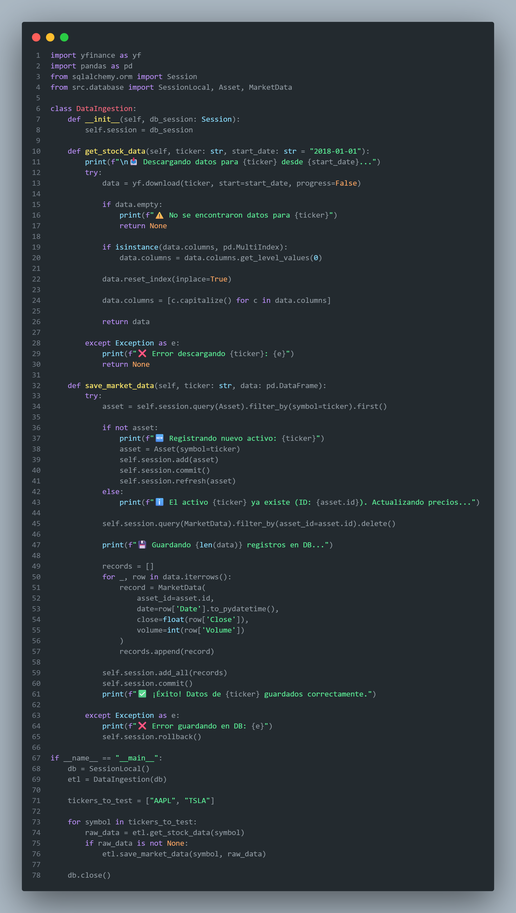

# 📉 Sistema de Simulación de Riesgo Financiero


> **Arquitectura Full-Stack para Ingeniería Financiera:** Cálculo de métricas de riesgo (VaR, Expected Shortfall) utilizando simulaciones de Monte Carlo, persistencia en SQL y visualización en Power BI.

---

## 📸 Resultados del Proyecto

### 1. Dashboard de Control (Power BI)
Tablero ejecutivo conectado a la base de datos que permite monitorear el riesgo de mercado en tiempo real, identificando activos peligrosos (Rojo) vs. seguros (Verde).


### 2. Interfaz de Usuario (Streamlit)
Aplicación web que permite buscar cualquier activo financiero, visualizar su historia y ejecutar proyecciones futuras bajo demanda.


---

## 📂 Arquitectura del Código

El sistema está modularizado en 4 componentes clave. A continuación se explica la lógica general de cada uno:

### 1. Base de Datos (`src/database.py`)
Es la base del sistema. Aquí definimos la estructura de las tablas usando **SQLAlchemy (ORM)**. Creamos un modelo relacional donde cada "Activo" (`Asset`) es padre de sus precios históricos (`MarketData`) y de sus simulaciones de riesgo (`SimulationResult`). Esto garantiza que los datos estén ordenados y listos para ser consumidos por Power BI.


---

### 2. Extracción de Datos (`src/extract.py`)
Este módulo se encarga de la ingesta de datos (ETL). Se conecta a la API de Yahoo Finance, descarga la historia de precios del activo solicitado, limpia la información (eliminando nulos) y la guarda masivamente en nuestra base de datos SQL. Incluye lógica para evitar duplicados si el activo ya existe.



---

### 3. Motor de Simulación (`src/simulation.py`)
El "cerebro" matemático del proyecto. En lugar de usar bucles lentos, utiliza **NumPy** para vectorizar operaciones.
* Calcula los retornos logarítmicos del activo.
* Aplica la fórmula del **Movimiento Browniano Geométrico** para proyectar miles de escenarios futuros en milisegundos.
* Calcula estadísticamente el **VaR 95%**, **VaR 99%** y el **Expected Shortfall (ES)** y guarda los resultados para su análisis posterior.


---

### 4. Interfaz Principal (`src/main.py`)
Es el orquestador que une todo. Construido con **Streamlit**, crea una página web interactiva donde el usuario puede:
1.  Ingresar un Ticker (ej: TSLA).
2.  Ver gráficos interactivos con **Plotly**.
3.  Configurar parámetros (Días a proyectar, Cantidad de escenarios).
4.  Ejecutar la simulación con un clic, la cual dispara internamente los procesos de cálculo y guardado en base de datos.


---

## 💻 Ejecución Local

1.  **Clonar el repositorio:**
    ```bash
    git clone [https://github.com/TU_USUARIO/Financial-Risk-Simulator.git](https://github.com/TU_USUARIO/Financial-Risk-Simulator.git)
    ```

2.  **Instalar dependencias:**
    ```bash
    pip install -r requirements.txt
    ```

3.  **Iniciar la Aplicación:**
    ```bash
    streamlit run src/main.py
    ```

4.  **Abrir Reporte:**
    * Ir a la carpeta `reports/` y abrir el archivo `.pbix` en Power BI Desktop.
## 🛠️ Arquitectura del Sistema

El proyecto sigue un flujo de datos lineal y robusto:

```mermaid
graph LR
A[Yahoo Finance API] -- JSON --> B(Python ETL)
B -- Clean Data --> C[(SQLite Database)]
C -- Historical Prices --> D{Monte Carlo Engine}
D -- Risk Metrics --> C
C -- ODBC/SQL --> E[Power BI Dashboard]
