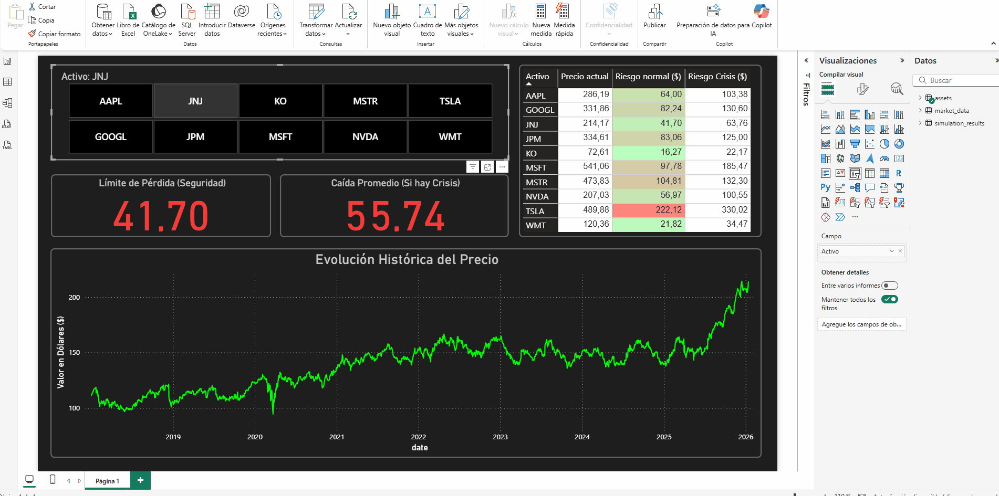
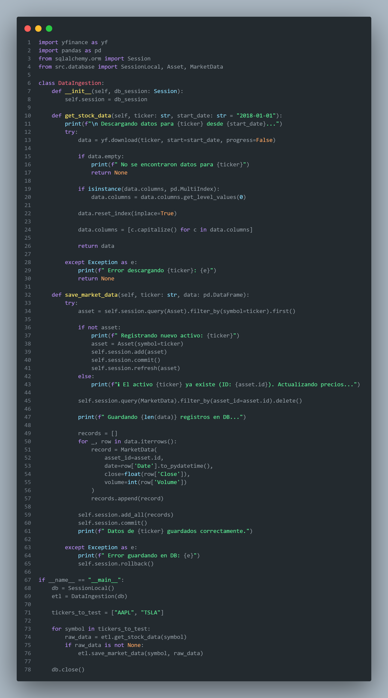
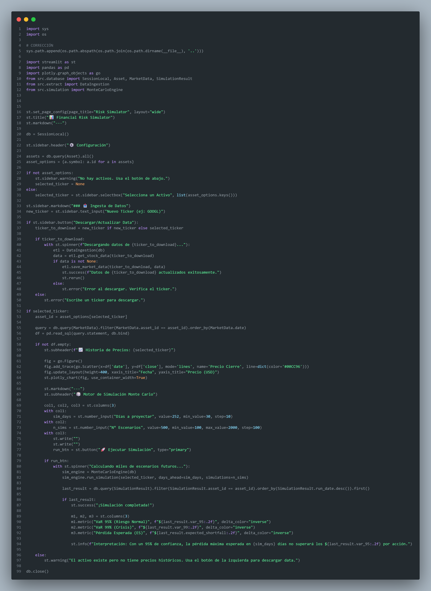
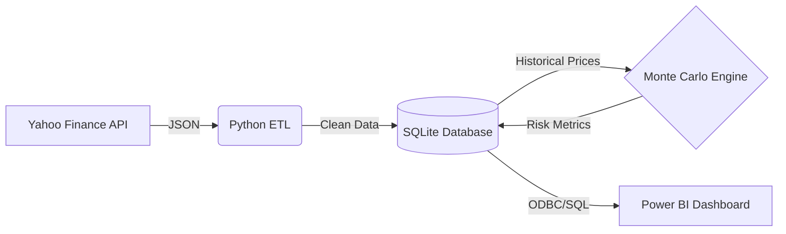

# 📉 Sistema de simulación de riesgo financiero


> En este proyecto quise construir una herramienta completa para analizar el riesgo de invertir en acciones. Mi objetivo fue armar un flujo real y automático, en donde primero se descargan los datos de internet para luego visualizarlos en un gráfico para tomar decisiones claras.
>
> 1.  **Obtención de Datos (ETL):** Creé scripts en Python que se conectan a internet, descargan los precios reales de las acciones y los limpian para que estén listos para usar.
> 2.  **Simulación Matemática:** Programé un motor de Monte Carlo (usando vectores) que proyecta desde pocos, a cientos o miles de posibles futuros para una acción, basándose en cómo se comporta matemáticamente el mercado.
> 3.  **Base de Datos:** Para mantener el orden, diseñé una base de datos SQL donde guardo toda la historia de precios y los resultados de mis simulaciones, así la información siempre está disponible.
> 4.  **Dashboard Visual:** Finalmente, conecté todo a Power BI. Mi idea fue transformar toda esta matemática calculada en algo visual y fácil de entender, usando tarjetas de powerbi para ver rápido qué acciones son seguras y cuáles son peligrosas.

## 📸 Resultados

### 1. Dashboard de Control (Power BI)
Diseñé este tablero conectándolo directamente a la base de datos, lo que me permite monitorear el riesgo de mercado en tiempo real, donde configuré semáforos para identificar activos peligrosos (Rojo) frente a los seguros (Verde).

▶️ **Dale Play para ver el funcionamiento del reporte:**


### 2. Interfaz de Usuario (Streamlit)
Desarrollé esta aplicación web para facilitar la interacción con el modelo matemático. Aquí puedo buscar cualquier activo financiero, analizar su historia visualmente y ejecutar mis proyecciones futuras bajo demanda.

▶️ **Dale Play para ver la simulación en vivo:**


---

## 📂 Arquitectura del Código

El sistema esta dividido en 4 componentes claves. A continuación explico cómo construí cada parte:

### 1. Base de Datos (`database.py`)
Establecí este módulo como la base del sistema. Aquí utilicé **SQLAlchemy (ORM)** para estructurar mis datos de forma relacional.
Como se ve en el código, definí las clases `Asset`, `MarketData` y `SimulationResult`. Configuré las relaciones (Foreign Keys) para que cada simulación quede vinculada estrictamente a su activo, garantizando que cuando conecte Power BI, los datos estén perfectamente ordenados y listos para modelar.


---

### 2. Extracción de Datos (`extract.py`)
En este script implementé toda la lógica de ingesta (ETL). Utilicé la librería `yfinance` para conectarme a la API y descargar los precios.
Dentro de la función `save_market_data` el sistema verifica si el activo ya existe para evitar duplicados. También incluí limpieza de datos, en donde debí eliminar los valores nulos de la data descargada antes de hacer el *commit* masivo a la base de datos, para no sobrecargar el repositorio con información innecesaria.



---

### 3. Motor de Simulación (`simulation.py`)
Este es el cerebro matemático del proyecto. Tomé la decisión de usar **NumPy** para vectorizar las operaciones matemáticas, logrando que el sistema sea mucho más rápido que usar bucles tradicionales.
En la función `run_simulation`, implementé la fórmula del **Movimiento Browniano Geométrico**. Calculo los retornos logarítmicos y genero matrices de miles de escenarios futuros. Finalmente, esta el cálculo estadístico automático del **VaR 95%**, **VaR 99%** y el **Expected Shortfall (ES)**, guardando estos resultados específicos para el análisis posterior.


---

### 4. Interfaz Principal (`main.py`)
Aquí use de base **Streamlit** para tener un despliegue web rápido y funcional.
En el código definí la barra lateral (`sidebar`) donde ingreso los parámetros de mi simulación (como el Ticker y los días a proyectar). Integré gráficos interactivos con **Plotly** para visualizar la historia de precios antes de simular. El botón "Ejecutar Simulación"  es el que inicia todo el pipeline, primero llama al ETL, ejecuta el motor matemático y guarda los resultados en la base de datos automáticamente.



---

## 💻 Ejecución Local

Si quieres correr mi proyecto en tu máquina, hay que seguir estos pasos:

1.  **Clonar el repositorio:**
    ```bash
    git clone [https://github.com/TU_USUARIO/Financial-Risk-Simulator.git](https://github.com/TU_USUARIO/Financial-Risk-Simulator.git)
    ```

2.  **Instalar dependencias:**
    ```bash
    pip install -r requirements.txt
    ```

3.  **Iniciar la Aplicación:**
    ```bash
    streamlit run src/main.py
    ```

4.  **Abrir Reporte:**
    * Ir a la carpeta `reports/` y abrir el archivo `.pbix` en Power BI Desktop.


## 🛠️ Arquitectura del Sistema

Diseñé el proyecto siguiendo un flujo de datos lineal como se ve a continuación:



---

## 🚧 Limitaciones y Próximos Pasos

Como este proyecto que realicé es mas que nada académico y de aprendizaje, hay algunos puntos que podrían mejorarse en una versión mejorada a futuro, o en un entorno profesional real:

### ⚠️ Posibles Fallos:
* **Dependencia de Yahoo Finance:** El sistema usa la librería gratuita `yfinance`. A veces, si se hacen muchas peticiones muy rápido, la API puede bloquear la conexión temporalmente o no traer datos de ciertos activos exóticos.
* **Modelo Matemático Idealizado:** La simulación usa el *Movimiento Browniano Geométrico*. Este modelo asume que los retornos del mercado siguen una "distribución normal" (curva de campana). En la vida real, existen los "Cisnes Negros" (caídas extremas) que este modelo a veces subestima.
* **Base de Datos Local:** SQLite es excelente para este uso local, pero si muchas personas intentaran escribir datos al mismo tiempo, podría bloquearse. En una empresa real, migraría esto a PostgreSQL o SQL Server.

### 🚀 Ideas para el Futuro:
Si tuviera más tiempo para seguir desarrollando este proyecto, me gustaría agregar:
1.  **Análisis de Sentimiento:** Conectar una IA que lea noticias de Twitter/X o Google News para ver si la gente habla bien o mal de la acción, y usar eso para ajustar la simulación.
2.  **Optimización de Portafolios:** Permitir simular no solo una acción a la vez, sino un portafolio completo (ej: 50% Apple, 50% Coca-Cola) para ver cómo se reduce el riesgo al diversificar.
3.  **Despliegue en la Nube:** Subir la aplicación a un servidor (como AWS o Render) para que cualquier persona pueda usarla desde su celular sin instalar nada.

---
